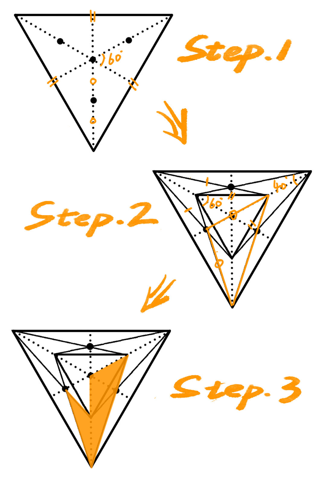

# 什么是 Three4Th

入大学前，几乎都没接触过计算机，曾天真地认为 Office 三件套就是全部，如今倒回去看，不免觉得蠢得有点夸张hhhhh

进入大学后，启蒙阶段的圣经几乎就是 CSDN，大二结束前，我也花了好一段时间去维护自己和实验室的 CSDN 内容，博客也是从那会儿进入我的世界，可能对于每一个向往技术的小白来说，拥有一个属于自己的博客是一件很酷的事。

在创建 Three4Th 之前，也尝试过很多次博客搭建，虽然文章都有不少阅读量（Google 搜索同类型主题基本都在 rank3 以内），但几乎都没能坚持下去。直到后面和崇哥、天哥他们接触，从他们的经验和处事中受益颇丰，重燃了我长期更新博客的动力。

博客是一种自由度非常高的载体，从它繁多复杂的扩展功能就不难看出：

- 希望互动可以添加评论区；
- 希望订阅可以添加 RSS；
- 甚至希望获得回馈可以添加收款码......

在动手之前，反复问自己，为什么要创建一个新的主题？之于现有的大部分主题，无非是换了皮肤的 Blog，从设计上吸引自己的用户，而我并不期待靠换皮设计获得满足。自认为是个内心丰富的人，在向外求索之余，常常渴望向内探索，所以我希望能即时记录自己的想法，幼稚的、独到的，亦或是突发奇想的......是的，听起来这是其他博客和主流社交软件也能解决的事情。

如之前提到的，每个人对博客的定位不同，因此，内容和主题的选择也不尽相同，当然，也不乏像我一样“既要、又要”的人，每当阅读他们的博客时，总有一个不太舒服的体验：日常记录中会突兀地插入几段技术文章，就好像微醺时突然被强制喝了一杯热水。当然，添加标签不失为一种有效分类的方法，但以文章形式不断切换日常记录，会给读者带来一定的心智负担：我一定要把这篇内容读完！我不希望读者，包括自己，在阅读日常记录时会有一种任务感，相对的，它应该是用来放松的，想阅读日记一样，值得回味的，下滑式的交互显然能让这种体验更加自然。

从读者的阅读体验出发，仅仅是因为作为笔者的自己，同样也是读者。我并不期待与读者产生过多的交集，因为在这个社交媒体四处喧然的时代，人们在网络上乱扔垃圾是一件极低成本的事，不希望被这种琐事浪费心情，所以不会考虑主动添加评论区。当然，也有来自外界的认可，所以会考虑留下邮箱，或许会增加一点社交成本，但对于一位潜在的、值得交往的朋友来说，我想这是值得的。不过在我看来，专心地丰富自己的内心世界或许更值得，因此，除了将 Diary 与 Blog 进行区分，我还引入了 Digital Garden 的形式。

## 什么是 Digital Garden

这似乎是很少见的一种形式（从我的认知范围内），它与 Blog 最大的区别在于具有作者的主观认可度。作为笔者，我不希望自己的内容因为不够完整、成熟，从而对他人造成困扰，同样，作为读者，我也不愿意浪费时间去鉴别一些低质量的文章。

不仅如此，我会有很多灵感一闪的想法，它像一阵风，如果不及时抓住就会立刻消失，我想把它当作一枚种子，先埋进土里，或许从此以后我都不会再理它，但或许在未来的某一天，我会给他浇水、松土，让它茁壮成长，直至成熟。因此，在自己即审核的情况下，Digital Garden 能很好地给予读者正确的心理预期：

- 这是一篇刚开始写的文章，可能本身就是错误的，请对它的内容保持质疑；
- 这是一篇正在研究的文章，可能内容存在纰漏，但它正在不断完善，请对它保持宽容；
- 这是一篇非常成熟的文章，已经经过了多次检查，请放心阅读，相信会对你（或许更重要是我自己）有所帮助。

所以，可以轻松地、及时地写下很多稀奇古怪的想法，等待它们慢慢发芽！

# Three4Th 的设计之路

有了想法，就可以开始慢慢动手实现了，虽然过程比较漫长，但也慢慢有了雏形：

- 要给它起一个有趣的名字：Three4Th；
- 要给它设计一个 Logo、完成度状态；
- 要给它选一个方便部署和管理的方案：Hugo+GitHub；
- 要给它选择一种易阅读的字体：LXGW WenKai；
- 要给它选择一个合适的色调：经典黑白永不会错；
- ......

## 为啥叫 Three4Th

建立起 Three4Th 的第一个文件夹时，正好是 2022 年 11 月，刚结束高斯的实习，回学校调整作息，感受颇多。我希望这份博客是易阅读的，有趣的，特别的......没有任何理由，潜意识里想到了 Three4Th 这个名字，它或许：
   
- 是我正好走完本科的 3/4，想借此记录一下；
- 是为了保证易读性，在设计之初的特地规划的留白比例；
- 是潜意识中致敬了 Platform Nine and Three-Quarters，一个有趣而神秘的元素；
- 是我不完美的人生态度，凡事尽全力就好，不必苛求结局满分......

总之，名字是莫名其妙给确定下来了～

## 设计一个 Logo

Logo 

